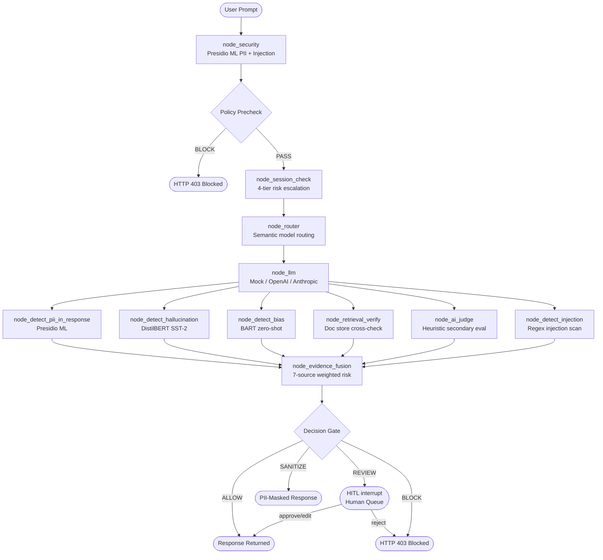

# Architecture — ControlPlane.ai

> **Accenture Innovation Challenge 2026, Round 2**
> A model-agnostic AI Governance Middleware built on LangGraph with real ML detectors.

---

## System Overview

ControlPlane.ai intercepts every prompt and every AI response, running them through a 14-node LangGraph pipeline before anything reaches the user. The result is a fully auditable, policy-enforced, human-overseen AI interaction layer.

```
┌───────────────────────────────────────────────────────────────────────┐
│                        Enterprise Application                         │
│               (Customer Support / Copilot / Decision Support)         │
└────────────────────────────────┬──────────────────────────────────────┘
                                 │  POST /api/v1/chat
                                 ▼
┌───────────────────────────────────────────────────────────────────────┐
│                     ControlPlane.ai Gateway (FastAPI)                 │
│                   Session tracking · Policy registry                  │
└────────────────────────────────┬──────────────────────────────────────┘
                                 │
                                 ▼
┌───────────────────────────────────────────────────────────────────────┐
│               LangGraph StateGraph (Async, Python 3.12)               │
│                                                                       │
│  [1] node_security           ← Presidio ML PII scan + injection check │
│       │                                                               │
│  [2] node_policy_precheck    ← Use-case + geography policy gate       │
│       │ (BLOCK if injection≥0.7 or risk=high)                        │
│       ▼                                                               │
│  [3] node_session_check      ← 4-tier cumulative risk escalation      │
│       ▼                                                               │
│  [4] node_router             ← Semantic routing (fast/smart/external) │
│       ▼                                                               │
│  [5] node_llm                ← LLM invocation (Mock / OpenAI / etc)  │
│       │                                                               │
│       ▼ ─────────────── Parallel Fan-Out ──────────────────────────► │
│  [6]  node_detect_pii_in_response    (Presidio, async executor)       │
│  [7]  node_detect_hallucination      (DistilBERT SST-2, async)        │
│  [8]  node_detect_bias               (BART zero-shot, background)     │
│  [9]  node_retrieval_verify          (Enterprise doc store, 8 docs)   │
│  [10] node_ai_judge                  (Heuristic secondary evaluator)  │
│  [11] node_detect_injection          (Regex injection in response)    │
│       │                                                               │
│       ▼ ─────────────── Evidence Merge (merge_evidence reducer) ────► │
│  [12] node_evidence_fusion   ← 7-source weighted composite risk       │
│       │                                                               │
│       ├── ALLOW   → [13] node_allow    → Response returned            │
│       ├── SANITIZE → [14] node_sanitize → PII-masked response returned │
│       ├── REVIEW  → [13] node_human_review → LangGraph interrupt()    │
│       └── BLOCK   → [13] node_block    → HTTP 403 raised              │
│                                                                       │
└───────────────────────────────────────────────────────────────────────┘
         │                                  │
         ▼                                  ▼
  SQLite Audit Log                   Dashboard (React)
  (full evidence trace)              (charts, HITL queue, tuner)
```

---

## LangGraph Flow Diagram



---

## Components

### 1. Security Gate (`backend/app/security/scanner.py`)
- **Microsoft Presidio** (NLP ML) — detects PERSON, EMAIL, PHONE, LOCATION, SSN, CREDIT_CARD, etc.
- **spaCy `en_core_web_sm`** — the underlying NER model
- Credential keyword detection (passwords, API keys, tokens)
- Injection keyword scoring (jailbreak phrases, system prompt override attempts)
- All heavy ML calls run in `asyncio.run_in_executor()` — non-blocking

### 2. LangGraph Orchestration (`backend/app/workflows/graph.py`)
- `ControlPlaneState` TypedDict with safe parallel reducers (`merge_evidence`, `merge_dicts`, `merge_lists`)
- 6 detection nodes run in **parallel** via `conditional_after_llm` fan-out
- `interrupt()` used for HITL — graph pauses and resumes via `Command(resume=payload)`
- Conditional edges route on `decision` field: ALLOW / SANITIZE / REVIEW / BLOCK

### 3. Evidence Fusion Engine (`backend/app/evaluation/evidence_fusion.py`)
- Collects all 7 evidence dicts from parallel nodes
- Weighted composite risk calculation (injection > PII > hallucination > bias > retrieval)
- Dual-source requirement for `VERIFIED` status (retrieval + AI-Judge both must confirm)
- Outputs: `CompositeRiskAssessment` with decision, primary_risk_category, overlapping_risks

### 4. ML Detectors

| Detector | Model | Method |
|---|---|---|
| PII (Input) | Presidio + spaCy en_core_web_sm | run_in_executor |
| PII (Response) | Presidio + spaCy en_core_web_sm | run_in_executor |
| Safety/Toxicity | DistilBERT SST-2 (HuggingFace) | run_in_executor |
| Bias | BART large MNLI zero-shot (5 categories) | Background thread + Event flag |
| Hallucination | Retrieval cross-reference + DistilBERT | run_in_executor |
| Injection | Keyword heuristics (instant) | Synchronous |
| AI Judge | Claim extraction heuristics | Synchronous |

### 5. Policy Registry (`backend/app/policies/registry.py`)
- Per use-case policies: `internal_copilot`, `customer_support`, `decision_support`
- Per geography overrides: `eu` (GDPR — stricter PII, block external models), `us`, `global`
- Controls: `pii_action`, `review_threshold`, `auto_approve_threshold`, `require_retrieval_verification`

### 6. Session Risk Tracker (`backend/app/session/context.py`)
- 4-tier escalation: `normal` → `review_elevated` → `review_forced` → `locked`
- Cumulative risk drift tracked across multi-turn conversations
- Locked sessions return BLOCK regardless of content

### 7. Auto-Threshold Tuner (`backend/app/evaluation/threshold_tuner.py`)
- Tracks FP rate (human approved what system escalated to REVIEW)
- Tracks FN rate (system allowed, human later rejected)
- Generates threshold adjustment recommendations for admin approval
- Recommendations stored in SQLite `threshold_recommendations` table

### 8. Human-in-the-Loop (`backend/app/api/dashboard.py`)
- LangGraph `interrupt()` pauses graph execution
- `/api/v1/reviews` returns pending REVIEW items
- `/api/v1/review/{id}?action=approve|reject|edit|regenerate` resumes graph
- Edit action allows reviewer to supply corrected text before resuming

### 9. Frontend (`frontend/src/`)
- **Dashboard** (`Dashboard.tsx`): KPI cards, Trust trend, Risk Vector radar, Detector latency bar, Decision distribution, Session risk timeline, Audit log with full pipeline trace, HITL queue, Threshold tuner panel, CSV export
- **Policy Tester** (`Tester.tsx`): Interactive prompt tester with use-case/geography selectors, 6 one-click examples, live governance trace, 30s timeout with clear error

---

## Data Flow (Request Lifecycle)

```
1. Client sends POST /api/v1/chat { prompt, use_case, geography, session_id }
2. FastAPI generates trace_id, builds ControlPlaneState
3. LangGraph ainvoke() starts the graph on a thread-safe async event loop
4. node_security runs Presidio in executor (~80-300ms)
5. node_policy_precheck evaluates use-case policy — may BLOCK immediately
6. node_session_check checks cumulative session risk
7. node_router picks model based on sensitivity + cost_budget
8. node_llm calls Mock/real LLM provider (~400-1200ms)
9. Six nodes run IN PARALLEL:
   - PII detection, Hallucination, Bias, Retrieval, AI Judge, Injection
10. merge_evidence reducer deduplicates and combines all evidence
11. node_evidence_fusion computes composite risk → decision
12. Decision branch:
    - ALLOW/SANITIZE/BLOCK: graph completes, response returned
    - REVIEW: graph pauses, audit log written with human_review_status=pending
13. AuditLog written to SQLite in BackgroundTask (non-blocking)
14. ChatResponse returned to client with trust_score, decision, overlapping_risks
```

---

## Database Schema

```sql
audit_logs (
  id TEXT PRIMARY KEY,           -- trace_id (UUID)
  timestamp DATETIME,
  prompt TEXT,
  response_text TEXT,
  sanitized_response TEXT,
  selected_model TEXT,
  use_case TEXT,
  geography TEXT,
  session_id TEXT,
  turn_number INTEGER,
  cumulative_session_risk FLOAT,
  security_result JSON,          -- full SecurityResult dict
  evaluation_result JSON,        -- factuality_score, safety_score
  composite_risk JSON,           -- risk_vectors, primary_risk, overlapping_risks
  trust_score FLOAT,
  risk_level TEXT,
  decision TEXT,                 -- ALLOW | SANITIZE | REVIEW | BLOCK
  verification_status TEXT,
  overlapping_risks JSON,
  primary_risk_category TEXT,
  detector_latencies JSON,       -- per-node ms timing
  human_review_required BOOLEAN,
  human_review_status TEXT,      -- na | pending | approved | rejected
  human_override BOOLEAN,
  human_override_decision TEXT
)
```
